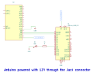

# SIMPLE LED DEMO - DOCUMENTATION

## 1. What the Demo Does

The Simple LED demo demonstrates a basic serial communication between a display and an Arduino. When the ON or OFF button on the display is pressed, the display automatically sends a packet through the serial connection. The Arduino receives this packet using `lumen_available()` and `lumen_get_first_packet()` functions, and then controls an LED based on the command received.

This project showcases how to receive a simple serial packet from the display and perform a basic hardware control operation by turning an LED on or off.

## 2. Purpose

This project is intended for educational and demonstration purposes. It illustrates the basics of serial communication between a display and an Arduino, with a focus on receiving commands and performing hardware control (turning an LED on or off).

## 3. How to Use

### 3.1 Setting up the Hardware

To set up the system and control the LED:
1. Connect an LED to digital pin 8 on the Arduino.
2. Ensure the LED's anode is connected to pin 8, and the cathode is connected to the GND of the Arduino through a 330Ω resistor.
3. Connect the display to the Arduino through a serial connection.

### 3.2 Sending Commands from the Display

The display interface includes ON and OFF buttons that, when pressed, send a serial packet to the Arduino:
- Pressing the **ON** button on the display sends a packet with a command to turn on the LED.
- Pressing the **OFF** button sends a command to turn off the LED.

The Arduino receives and interprets these packets to control the LED accordingly.

## 4. Power Supply
* The Arduino can be powered via USB (5V) or an external 5V power supply. The display should be powered through the +Vin and GND pins, with a voltage of either 5V or 12V.

## 5. Schematic Circuit

The circuit for the Simple LED demo includes an LED connected to digital pin 8 on the Arduino, with a 330Ω current-limiting resistor in series.



## 6. Code


The main code for this project is implemented in C++ and uses the Lumen protocol to handle the reception of packets from the display and control the LED state. The code below shows the full implementation:

```cpp

#include "LumenProtocol.h"

#define LCM_BAUDRATE 115200  // Data transmission rate

// Configuration constants
const uint8_t LED_PIN = 8;              // LED pin
const uint8_t LED_ON = 1;               // Value to turn the LED on
const uint8_t LED_OFF = 0;              // Value to turn the LED off
const uint8_t LED_STATUS_ADDRESS = 20;  // Address for the LED packet
const uint16_t INIT_DELAY = 1000;       // Initial delay

// Defining the packet for LED control
lumen_packet_t led_status = { LED_STATUS_ADDRESS, kS32 };  // Packet with address 20 and int32 data type
lumen_packet_t *current_packet;                            // Pointer to the current packet

// Functions for sending and receiving data via Lumen protocol
extern "C" void lumen_write_bytes(uint8_t *data, uint32_t length) {
  Serial.write(data, length);
}

extern "C" uint16_t lumen_get_byte() {
  if (Serial.available()) {
    return Serial.read();
  }
  return DATA_NULL;
}

// System initialization
void setup() {
  delay(INIT_DELAY);           // Initial delay
  Serial.begin(LCM_BAUDRATE);  // Initialize serial communication
  pinMode(LED_PIN, OUTPUT);    // Set the LED pin as output
}

// Helper function for controlling the LED
void controlLed(int state) {
  if (state == LED_ON) {
    digitalWrite(LED_PIN, HIGH);  // Turn the LED on
  } else if (state == LED_OFF) {
    digitalWrite(LED_PIN, LOW);  // Turn the LED off
  }
}

// Function to process the received packet
void processPacket(lumen_packet_t *packet) {
  if (packet->address == LED_STATUS_ADDRESS) {  // Check if the packet is for the LED control
    int led_state = packet->data._s32;          // Get the LED state from the packet
    controlLed(led_state);                      // Control the LED based on the command
  }
}

// Main loop
void loop() {
  // Check if a packet is available from the display
  while (lumen_available() > 0) {
    current_packet = lumen_get_first_packet();  // Retrieve the first available packet
    processPacket(current_packet);              // Process the received packet to control the LED
  }
}

